# Beer API - Documento de Pruebas

Este documento describe todas las pruebas a realizar sobre la API y dónde guardar los resultados.

---

## Configuración Previa

- **URL Base:** `http://localhost:8080`
- **Asegúrate de que la aplicación está corriendo** (BeerApiApplication)

---

## PRUEBAS A REALIZAR

### 1. BEERS (CRUD Completo)

#### 1.1 GET - Listar todas las cervezas
- **Método:** GET
- **URL:** `http://localhost:8080/beers`
- **Resultado esperado:** Lista JSON con todas las cervezas (Status 200)

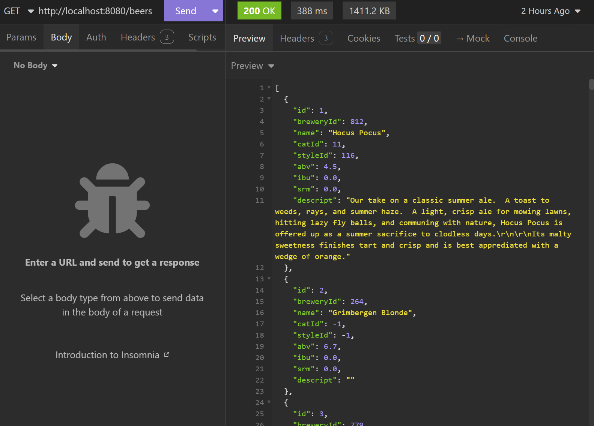

---

#### 1.2 GET - Obtener cerveza por ID
- **Método:** GET
- **URL:** `http://localhost:8080/beer/1`
- **Resultado esperado:** JSON con los datos de la cerveza con id=1 (Status 200)

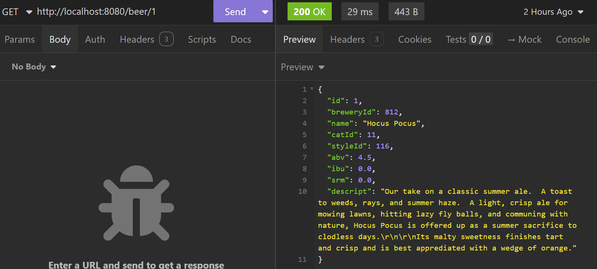

---

#### 1.3 POST - Crear nueva cerveza
- **Método:** POST
- **URL:** `http://localhost:8080/beer`
- **Headers:** `Content-Type: application/json`
- **Body (JSON):**
```json
{
  "name": "Mi Cerveza de Prueba",
  "breweryId": 1,
  "catId": 3,
  "styleId": 26,
  "abv": 5.5,
  "ibu": 35,
  "srm": 8,
  "descript": "Cerveza creada para probar el POST"
}
```
- **Resultado esperado:** JSON con la cerveza creada incluyendo su nuevo ID (Status 201)

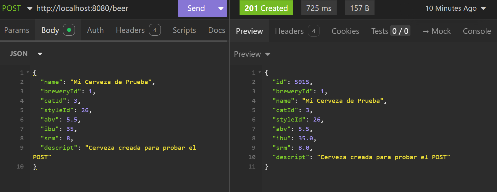

---

#### 1.4 PUT - Actualizar cerveza
- **Método:** PUT
- **URL:** `http://localhost:8080/beer/{id}` (usa el ID de la cerveza creada en 1.3)
- **Headers:** `Content-Type: application/json`
- **Body (JSON):**
```json
{
  "name": "Cerveza Actualizada",
  "abv": 6.0,
  "descript": "Descripción modificada con PUT"
}
```
- **Resultado esperado:** JSON con la cerveza actualizada (Status 200)

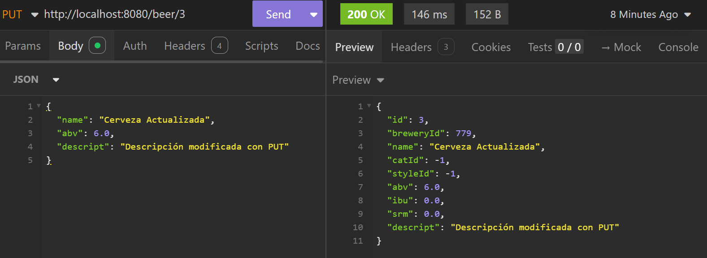

---

#### 1.5 DELETE - Eliminar cerveza
- **Método:** DELETE
- **URL:** `http://localhost:8080/beer/{id}` (usa el ID de la cerveza creada en 1.3)
- **Resultado esperado:** Sin contenido (Status 204)

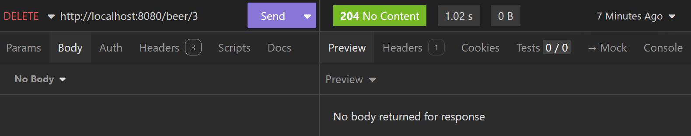
---

#### 1.6 GET - Verificar error 404
- **Método:** GET
- **URL:** `http://localhost:8080/beer/99999`
- **Resultado esperado:** Error JSON indicando que no se encontró (Status 404)

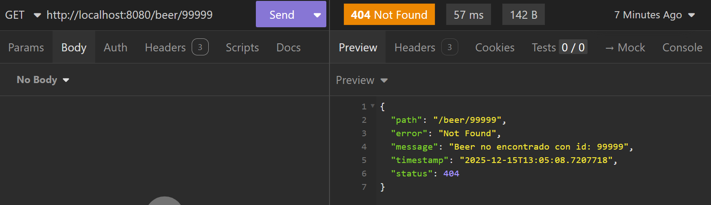

---

### 2. BREWERIES (Solo lectura)

#### 2.1 GET - Listar todas las cerveceras
- **Método:** GET
- **URL:** `http://localhost:8080/breweries`
- **Resultado esperado:** Lista JSON con todas las cerveceras (Status 200)

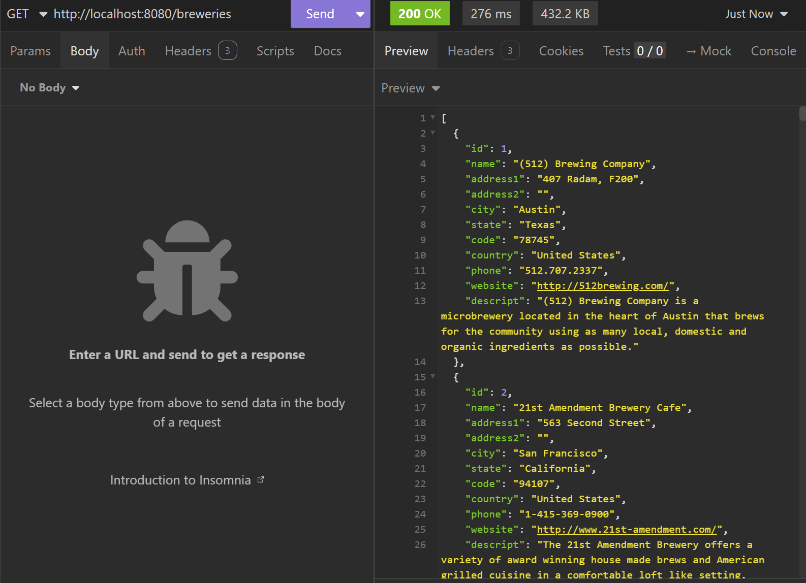

---

#### 2.2 GET - Obtener cervecera por ID
- **Método:** GET
- **URL:** `http://localhost:8080/brewerie/1`
- **Resultado esperado:** JSON con los datos de la cervecera con id=1 (Status 200)

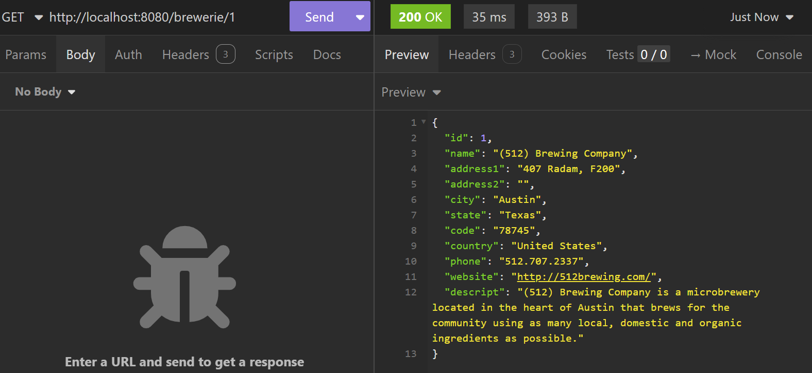

---

### 3. CATEGORIES (Solo lectura)

#### 3.1 GET - Listar todas las categorías
- **Método:** GET
- **URL:** `http://localhost:8080/categories`
- **Resultado esperado:** Lista JSON con todas las categorías (Status 200)

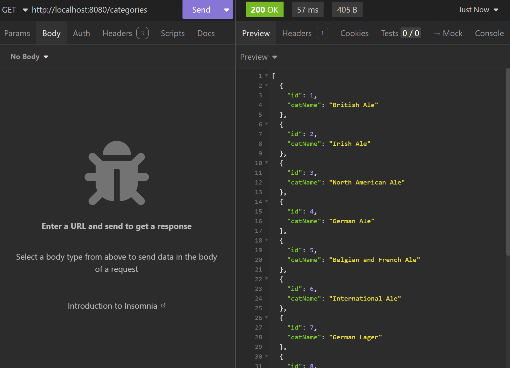

---

#### 3.2 GET - Obtener categoría por ID
- **Método:** GET
- **URL:** `http://localhost:8080/categorie/1`
- **Resultado esperado:** JSON con los datos de la categoría con id=1 (Status 200)

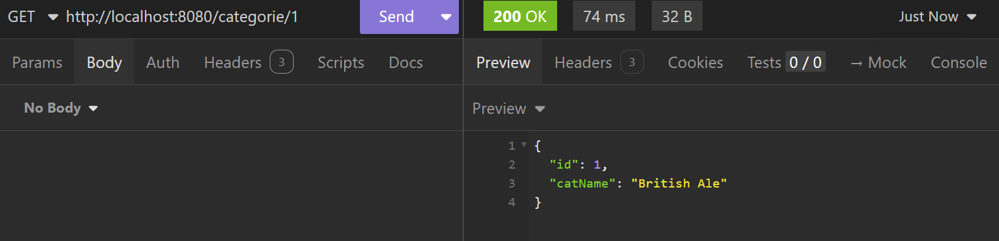

---

### 4. STYLES (Solo lectura)

#### 4.1 GET - Listar todos los estilos
- **Método:** GET
- **URL:** `http://localhost:8080/styles`
- **Resultado esperado:** Lista JSON con todos los estilos (Status 200)

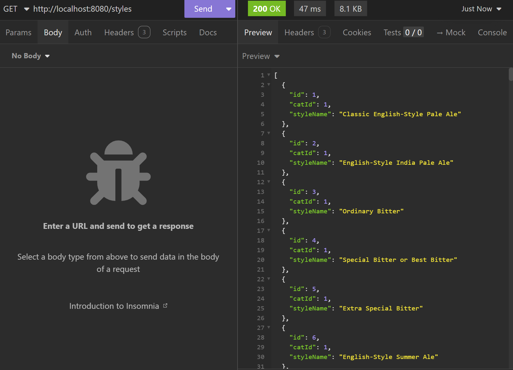

---

#### 4.2 GET - Obtener estilo por ID
- **Método:** GET
- **URL:** `http://localhost:8080/style/1`
- **Resultado esperado:** JSON con los datos del estilo con id=1 (Status 200)

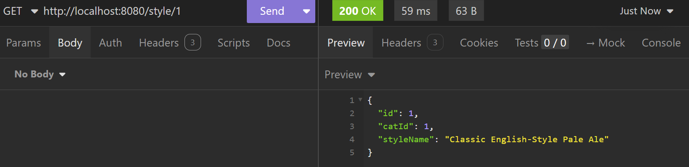

---

## RESUMEN DE PRUEBAS

| # | Endpoint     | Método | Status Esperado | ✅/❌ |
|---|--------------|--------|-----------------|------|
| 1.1 | /beers       | GET | 200 | |
| 1.2 | /beer/1      | GET | 200 | |
| 1.3 | /beer        | POST | 201 | |
| 1.4 | /beer/{3}    | PUT | 200 | |
| 1.5 | /beer/{3}    | DELETE | 204 | |
| 1.6 | /beer/99999  | GET | 404 | |
| 2.1 | /breweries   | GET | 200 | |
| 2.2 | /brewerie/1  | GET | 200 | |
| 3.1 | /categories  | GET | 200 | |
| 3.2 | /categorie/1 | GET | 200 | |
| 4.1 | /styles      | GET | 200 | |
| 4.2 | /style/1     | GET | 200 | |

---
